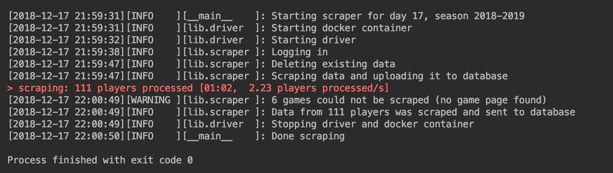

# Mercatool

This tool is a web scraper used to collect MPG (a soccer fantasy league) data and to insert it into 
a postgres database.

## 1. Description

Two scrapers are part of this project:

- **DetailScraper:** this scraper collects data regarding the performance of all players who actually 
played on a given championship day, and inserts it into a postgres table
- **RatingScraper:** this scraper collects data regarding all players' position and rating at a given
time, and inserts it into a postgres table

The two resulting tables can be joined on columns: (season, day, team, player).

Both scrapers run on a dockerized `Selenium` browser.  The HTML parser used is `BeautifulSoup4`. The 
parsed data is inserted into the postgres database using `psycopg2`.

Python generators are being used for efficiency and scalability. At the end of the process, insert 
queries are being grouped into small batches before being executed.


## 2. How To

### Setting things up

To get the scraper to run, you will need to have:

- A python environment (3.6+) meeting the requirements specified in the file `requirements.txt`
- A "Standalone-Chrome" selenium docker image (3.14+), with the proper name and version specified in
the driver configuration file (`conf/driver.yaml` per default). Such an image can be pulled from 
[here](https://hub.docker.com/u/selenium), or built using 
[this](https://github.com/DeinChristian/rpi-docker-selenium) for armhf (Armv7) based devices.
- A postgres database with two tables, which creation SQL queries can be found in the `ddl` folder 
(`details.sql` and `ratings.sql`). The names must be matching those in the configuration file 
`conf/details.yaml` or `conf/ratings.yaml`
- A credentials file `conf/credentials.yaml` following the format described in 
`conf/credentials_format.yaml` 


### Running the scraper

The file `main.py` may be run in order to run the scraper. It has two required arguments `--day` and
 `--scraper`.

Example bash command:

```bash
workon mercatoolenv3
python main.py --day 17 --scraper conf/details.yaml
```

Example console output:




The "ratings" scraper can be run in a similar manner, using `conf/ratings.yaml`.
